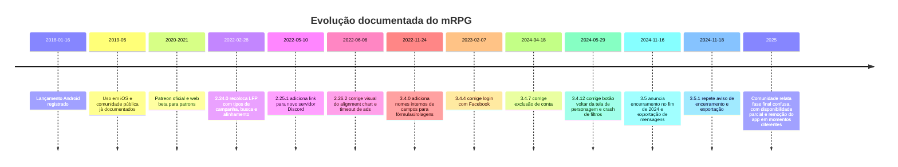

# DiceRpg

# Relatório analítico do mRPG

## Resumo executivo

A premissa de que o **mRPG teria sido descontinuado em 2022** não se sustenta à luz das fontes primárias e quasi-primárias disponíveis. O que a documentação mostra é uma trajetória contínua de manutenção e evolução ao longo de 2022, 2023 e 2024, com marcos explícitos em **2.24.0** de fevereiro de 2022, **3.4.0** de novembro de 2022, **3.4.4** de fevereiro de 2023, várias correções em 2024 e, por fim, as versões **3.5/3.5.1** de novembro de 2024, que anunciaram formalmente o encerramento “até o fim de 2024” e adicionaram **exportação das mensagens das campanhas**. O desligamento real parece ter sido gradual: em 2025 ainda havia relatos comunitários de disponibilidade parcial, enquanto outros usuários já falavam em remoção do app e encerramento do serviço; a **data final exata** não apareceu, nas fontes acessíveis, em uma comunicação oficial indexada. citeturn31search1turn44search12turn38view0turn27search13turn43search2turn47search5

Funcionalmente, o mRPG era **menos um VTT tático completo** e mais um **ecossistema de chat assíncrono para RPG de mesa**, com quatro pilares centrais: **descoberta/recrutamento de grupos**, **fichas altamente customizáveis**, **rolagem de dados e macros**, e **interpretação por persona** — jogador, personagem, narrador e NPC. A própria descrição oficial enfatiza jogar “quando puder”, sem necessidade de sincronizar agenda, enquanto a landing page oficial destaca “Character Sheets, Rolling Dice and Chat”, “Create Macros”, “You can be whoever you want!” e “Create your own Sheets”. citeturn32view0turn38view0turn31search0turn44search3

O grande diferencial do produto, portanto, era permitir **campanhas por texto em celular** com **suporte agnóstico a sistema** e forte tolerância a homebrew. O mestre podia definir o **template de ficha**, criar personagens, atribuí-los a jogadores, falar como narrador ou NPC, e usar macros para tarefas repetitivas como ataques e iniciativa. Em 2022, o LFP voltou com **tipos de campanha** como RPG, Chat, Invite e ERP, além de busca textual, filtros e um sistema de **alinhamento/reputação** inspirado em D&D. citeturn32view0turn38view0turn31search1turn54view0

Em contrapartida, **não encontrei evidência robusta** de battlemap interativo, grid, tokens, tracker de combate dedicado, gerenciamento de cenas, áudio embutido, marketplace oficial, módulos/plugins ou um sistema formal de handouts comparável a VTTs full-featured. Quando mapas apareciam, a evidência aponta para **envio de imagens no chat** e, em usos mais complexos, para o **uso paralelo de materiais externos** através do cliente web. citeturn32view0turn53search2turn16view0

## Identidade do produto e estado real da descontinuação

O nome comercial consolidado era **“mRPG - Chat app to play RPGs”**, com package id **`com.adrianocola.mrpg`** no Android. O app aparece nas lojas espelhadas e serviços de inteligência móvel como um produto de **Communication / Chat & Instant Messaging**, o que reforça que seu núcleo era conversacional. O lançamento Android foi registrado em **16 de janeiro de 2018**, e o app ainda tinha distribuição documentada em Android e iOS em 2024, além de um cliente web em **`web.mrpg.app`**. citeturn21search0turn13view0turn38view0turn16view0turn54view0

Há também uma pequena ambiguidade de identidade institucional. Em metadados de distribuição, o Android aparece associado a **Adriano Emerick Cola** em algumas páginas, enquanto a distribuição iOS espelhada e outros metadados recentes usam **Glue Fields / GlueFields** como publisher. Já a página oficial no Facebook apresenta uma equipe com Adriano, Felipe e outros colaboradores. O quadro mais prudente é tratar o mRPG como um produto que começou fortemente associado ao fundador e depois passou a circular também sob uma marca-estúdio. A documentação pública acessível não esclarece a estrutura societária exata. citeturn13view0turn38view0turn8search5turn8search20

Abaixo, a ficha técnica consolidada com base nas fontes mais confiáveis acessíveis:

| Campo | Consolidação |
|---|---|
| Nome comercial | **mRPG - Chat app to play RPGs**. citeturn38view0turn32view0 |
| Natureza do produto | App de **chat/mensageria para RPG**, com fichas, dados e recrutamento de mesas. citeturn21search0turn32view0turn31search0 |
| Lançamento documentado | **16 jan. 2018** no Android. citeturn21search0 |
| Plataformas documentadas | **Android, iOS e Web**. A página oficial de termos linkava tanto iTunes quanto Google Play, e o cliente web existia em `web.mrpg.app`. citeturn54view0turn16view0turn38view0 |
| Package ID Android | **com.adrianocola.mrpg**. citeturn13view0turn31search1 |
| Requisitos Android mais recentes documentados | Android **6.0+** na 3.5.1; versões antigas também existiam para Android 5.0+. citeturn13view0turn31search1 |
| Modelo de negócio | **Grátis**, com **anúncios**, indício de **in-app purchase** em metadata móvel e **Patreon** como via de apoio. citeturn21search0turn54view0turn41search1 |
| Status de encerramento | **Encerramento anunciado no fim de 2024** na 3.5/3.5.1; desligamento real exato **não especificado** em fonte oficial acessível. citeturn38view0turn27search13turn43search2turn47search5 |

O dado mais importante para corrigir a cronologia é simples: **2022 foi ano de atualização importante, não de descontinuação**. Em fevereiro de 2022 a versão **2.24.0** recolocou o LFP com mudanças profundas; em novembro de 2022 a versão **3.4.0** adicionou nomes internos a campos para uso em fórmulas e rolagens; em 2023 vieram correções como o login por Facebook; e em 2024 houve manutenções frequentes até o anúncio formal de desligamento. citeturn31search1turn44search12turn38view0

## Linha do tempo da plataforma

A linha do tempo abaixo resume os marcos documentados por landing page oficial, termos, changelogs em espelhos de lojas e registros comunitários. Como a data de desligamento definitivo não foi publicada, em fonte acessível, com um carimbo oficial preciso, o evento final fica marcado como **encerramento anunciado** e **queda efetiva gradual**. citeturn21search0turn31search1turn38view0turn41search3turn43search2turn47search5

Em termos de evolução de produto, três momentos são especialmente relevantes. O primeiro é o **lançamento como app de chat para RPG**, focado em campanhas, personagens, dados e recrutamento. O segundo é a **reconstrução do LFP em 2.24.0**, que profissionalizou a camada pública de descoberta com tipos de campanha, busca, filtro, verificação de telefone e alinhamento reputacional. O terceiro é a fase **3.4.x → 3.5.x**, que mostra o produto indo de customização mais profunda de fichas e fórmulas para um estágio final de **hardening/correções** e, enfim, **preservação mínima por exportação de mensagens** antes do encerramento. citeturn32view0turn31search1turn44search12turn38view0

## Arquitetura funcional e interface

Analiticamente, o mRPG tinha uma arquitetura de uso muito clara: **descobrir ou criar uma campanha**, **entrar em um espaço de chat**, **associar-se a uma persona**, e **usar ficha/dados/macros** sem sair do fluxo conversacional. A interface promocional mais reveladora mostra uma **coluna esquerda com campanhas**, um **painel central de mensagens** e um **painel direito para personagens/fichas**. Essa distribuição sugere uma UI desenhada para combinar mensageria, consulta de dados do personagem e administração leve da campanha em uma única superfície. citeturn39view0turn39view1turn39view2

Isso ajuda a explicar por que a comunidade o descrevia, na prática, como um **“WhatsApp para PbP” com dados e fichas**. A inferência é forte porque coincide com o posicionamento oficial das lojas, com a promessa de jogar “quando puder” e com relatos de usuários que buscavam justamente um substituto que preservasse a mistura de **múltiplos personagens, retratos, chat e rolagens**, sem cair em um VTT pesado ou em um produto estritamente voltado a D&D 5e. citeturn38view0turn32view0turn20search1turn33search4turn42search6

### Referências visuais e audiovisuais úteis

| Referência | O que mostra | Observação analítica |
|---|---|---|
| Captura promocional de descoberta pública. citeturn39view0 | Catálogo de campanhas com **barra de busca**, cartão da campanha e **modal de ingresso** com botão para pedir entrada. | É a melhor evidência visual do **LFP/Find Games** e do fluxo de recrutamento. |
| Captura promocional de chat de campanha. citeturn39view1 | **Coluna esquerda** de campanhas, **chat central** e **painel direito** com lista de personagens. | Mostra a espinha dorsal da UX: mensageria + persona + administração leve. |
| Captura promocional de ficha customizada. citeturn39view2turn5view2 | Ficha com retrato, atributos e abas visíveis de **Sheet / Inventory / Log**. | Confirma que a ficha não era só um bloco de texto; havia **estrutura interna** e inventário/log acoplados. |
| Captura Android focada em interpretação por persona. citeturn40view0 | Mensagens saindo com diferentes nomes/avatares. | Evidencia a ideia de **“falar como quem você quiser”**. |
| Captura Android focada em dados e macros. citeturn40view1turn44search3 | Chat com área de composição e destaque promocional para **Roll Dices / Create macros**. | Reforça que a automação estava **dentro** do fluxo de chat, não em um módulo isolado. |
| Captura Android de criação de campanha. citeturn14view5 | Formulário de criação com seleção de tipo/categoria e opções de publicação. | Útil para localizar o ponto de entrada de campanhas públicas e privadas. |
| Tutorial comunitário “How To Get Started”. citeturn35search1turn53search7 | O resumo indexado indica **nova campanha**, **custom sheet** e primeiros passos. | Serve como documentação comunitária de onboarding. |
| Vídeo comunitário “How to play RPG on the mobile phone only”. citeturn37search5 | Contextualiza o mRPG como solução móvel para jogar RPG sem desktop. | Bom para entender o **caso de uso móvel-first** do produto. |

O cliente web, por sua vez, não apontava para um VTT autônomo muito diferente do app móvel. A página acessível exige JavaScript e a comunidade o descrevia como útil para narradores manterem **mapas e notas** abertos ao lado do chat, o que sugere uma extensão de conveniência de desktop, e não uma segunda plataforma com regras próprias, tokens e grid. citeturn16view0turn53search2

## Inventário categorizado de funcionalidades

Abaixo está o inventário funcional mais abrangente que consegui reconstruir, organizado por domínio de uso. Sempre que a versão inicial exata não foi comprovável pelas fontes acessíveis, marquei como **não especificada**.

### Descoberta, recrutamento e estrutura de campanha

| Recurso | Descrição e localização de UI | Prova visual ou URL | Primeira e última versão | Limitações, bugs e exemplos comunitários |
|---|---|---|---|---|
| **Campanhas** | Núcleo do produto. Era possível **criar campanhas** e participar de **várias ao mesmo tempo**. Na UI promocional, elas aparecem na **barra lateral esquerda** e são abertas no centro. | Descrições oficiais de loja e captura de chat/lista. citeturn32view0turn38view0turn39view1 | **Inicial:** não especificada. **Final documentada:** 3.5.1. citeturn38view0 | Sem evidência de agenda/calendário embutido; o produto foi vendido como jogo “quando puder”, isto é, assíncrono. citeturn32view0turn38view0 |
| **Looking for Players / Find Games** | Sistema público para **listar campanhas** e **pedir entrada**. Na interface web/iPad há **busca no topo**, cards de campanha e modal de adesão. | Landing page, termos e captura de descoberta. citeturn31search0turn54view0turn39view0 | **Inicial:** existente antes de 2022, mas **reintroduzido** em 2.24.0. **Final:** 3.5.1. citeturn31search1turn38view0 | Em 2022 o LFP estava ausente durante uma fase de bugs e voltou com a 2.24.0. Houve também queixas comunitárias sobre qualidade do espaço público de recrutamento. citeturn43search1turn45search0 |
| **Tipos de campanha** | A 2.24.0 documenta categorias **RPG, Chat, Invite e ERP**, indicando uso tanto para RPG de mesa quanto para roleplay textual mais amplo. Apareciam no formulário de criação e nos filtros públicos. | Changelog 2.24.0 e captura de criação. citeturn31search1turn14view5 | **Inicial explícita:** 2.24.0. **Final:** 3.5.1. citeturn31search1turn38view0 | Conteúdo maduro dependia de maioridade legal e classificação correta da campanha. citeturn54view0 |
| **Busca textual e filtros** | A 2.24.0 adicionou **busca por texto** e **filtro por tipo de campanha** no catálogo público. | Changelog 2.24.0 e UI de descoberta com busca. citeturn31search1turn39view0 | **Inicial explícita:** 2.24.0. **Final:** 3.5.1. citeturn31search1turn38view0 | Em 3.4.12 houve correção para **crash de filtros**, o que indica fragilidade real nesta área da UI. citeturn38view0 |
| **Fluxo de entrada em campanhas** | Usuários podiam **pedir para entrar** em uma campanha; o **GM precisava aceitar**. O modal de descoberta pública confirma esse fluxo. | Descrição oficial e captura do modal de join. citeturn32view0turn38view0turn39view0 | **Inicial:** não especificada. **Final:** 3.5.1. citeturn38view0 | Exemplo de uso: campanhas públicas para Open Legend e Star Wars apareceram em fóruns e fandoms usando o app como porta de entrada. citeturn37search11turn22search0 |
| **Chats privados e DMs** | Além de campanhas, o mRPG permitia **conversas privadas de grupo** e **conversa individual** entre usuários. | Termos oficiais. citeturn54view0 | **Inicial:** não especificada. **Final:** 3.5.1. citeturn54view0 | A moderação podia acessar conteúdo **reportado**, o que limita a ideia de privacidade absoluta. citeturn54view0 |

### Interpretação, chat e registro da sessão

| Recurso | Descrição e localização de UI | Prova visual ou URL | Primeira e última versão | Limitações, bugs e exemplos comunitários |
|---|---|---|---|---|
| **Chat assíncrono de campanha** | O coração do mRPG era um **chat persistente** onde as ações, falas e rolagens ficavam registradas. Na UI, ele ocupa o **painel central**. | Descrições oficiais e captura do chat. citeturn32view0turn38view0turn39view1 | **Inicial:** não especificada. **Final:** 3.5.1. citeturn38view0 | Houve relatos recorrentes de **mensagens que não chegavam** e **downtime do servidor**, afetando diretamente o uso do chat. citeturn42search1turn42search4 |
| **Falar como jogador, personagem, narrador ou NPC** | A proposta oficial era não precisar “ser você mesmo o tempo todo”. O GM podia falar como **ele mesmo**, como **narrador** ou como **NPC**; jogadores podiam falar como **eles mesmos** ou como o personagem designado. | Descrição oficial, landing page e captura de mensagens por persona. citeturn32view0turn38view0turn31search0turn40view0 | **Inicial:** não especificada. **Final:** 3.5.1. citeturn38view0 | Este era um dos traços mais lembrados pela comunidade na busca de alternativas. Usuários migrados para Discord tentaram reproduzi-lo com bots como TupperBox. citeturn33search4turn20search1 |
| **Lista de personagens e troca rápida** | O material promocional mostra um **painel direito de personagens**, indicando seleção rápida de quem está “falando” ou sendo consultado. | Captura promocional da interface web/iPad. citeturn39view1 | **Inicial:** não especificada. **Final:** 3.5.1. citeturn39view1turn38view0 | Excelente para PbP e múltiplos NPCs, mas não há evidência de um **bestiário/compêndio NPC** separado; tudo indica uso de personagens/personas dentro da própria campanha. citeturn31search0turn39view1 |
| **Envio de imagens** | A descrição oficial diz que era possível enviar **imagens** como **mapas** e **monstros** diretamente no chat. | Descrição Aptoide. citeturn32view0 | **Inicial:** não especificada. **Final:** 3.5.1. citeturn32view0 | Não há evidência de canvas interativo; em uso avançado, mestres mantinham **mapas e notas externos** abertos ao lado da web app. citeturn53search2 |
| **Log / histórico** | A própria persistência do chat já servia como **registro da campanha**, e a interface de ficha mostrava uma aba **Log**. | Capturas promocionais. citeturn39view2turn5view2 | **Inicial:** não especificada. **Final:** 3.5.1. citeturn39view2turn38view0 | Durante anos a comunidade pediu maneiras de **exportar** ou salvar esse histórico; só na 3.5/3.5.1 surgiu exportação oficial de mensagens. citeturn36search3turn38view0 |
| **Notificações push e mute** | As mensagens geravam **push notifications**, e o usuário podia **mutar chats, usuários e campanhas individualmente**. | Termos oficiais. citeturn54view0 | **Inicial:** não especificada. **Final:** 3.5.1. citeturn54view0 | Como toda a entrega dependia do backend, problemas de conectividade afetavam diretamente a sensação de confiabilidade do produto. citeturn42search1turn42search4 |

### Fichas, inventário, dados, macros e automação

| Recurso | Descrição e localização de UI | Prova visual ou URL | Primeira e última versão | Limitações, bugs e exemplos comunitários |
|---|---|---|---|---|
| **Templates de ficha customizados** | O GM podia definir o **template de ficha** que toda a campanha usaria. A UI promocional mostra a ficha em um **drawer/painel lateral direito**. | Descrição de loja, landing page, captura de ficha e tutorial. citeturn32view0turn31search0turn39view2turn35search1 | **Inicial:** não especificada. **Final:** 3.5.1. citeturn38view0 | Este era o grande diferencial frente a concorrentes focados em um sistema só. Usuários faziam fichas para sistemas como **Open Legend** e D&D homebrew. citeturn37search11turn33search4 |
| **Atribuição de personagens a jogadores** | O mestre podia **criar personagens** e **atribuí-los** a jogadores; cada jogador cuidava da própria ficha. | Descrições oficiais Android/iOS. citeturn32view0turn38view0 | **Inicial:** não especificada. **Final:** 3.5.1. citeturn38view0 | Houve relatos de campanhas em que a ficha aparecia para uns usuários e para outros não, mostrando fragilidade de sincronização. citeturn46search1 |
| **Campos customizados, fórmulas e referências internas** | Em **3.4.0** o app passou a permitir **nome interno opcional em campos**, para usá-los como referência em **fórmulas** e **rolagens de dados**. | Changelog 3.4.0. citeturn44search12turn51search12 | **Inicial explícita:** 3.4.0. **Final:** 3.5.1. citeturn44search12turn38view0 | A comunidade via as fichas quase como “programação leve”. Isso aumentava poder, mas também complexidade; havia dúvidas até sobre como trabalhar quebras de linha em fórmulas de macro. citeturn47search1turn45search0 |
| **Rolagem de dados no chat** | O app aceitava notação padrão, como **1d20**, **3d6** e **d20+10**, e exibia o resultado **sem sair do chat**. | Descrições oficiais e captura promocional. citeturn32view0turn38view0turn40view1 | **Inicial:** não especificada. **Final:** 3.5.1. citeturn38view0 | O dado embutido era frequentemente citado como forte. Ao mesmo tempo, havia tópicos de ajuda sobre estatísticas/rolagens ou comportamentos estranhos, o que sugere alguma curva de uso. citeturn42search0turn44search5 |
| **Macros** | A macro era apresentada oficialmente como forma de automatizar **ataques**, **iniciativa** e tarefas rotineiras, dentro do fluxo do jogo. | Landing page oficial, captura Android e tutorial. citeturn44search3turn40view1turn35search1 | **Inicial:** não especificada. **Final:** 3.5.1. citeturn44search3turn38view0 | Muito poderosa para homebrew, mas sem documentação pública formal localizada. A comunidade compartilhava soluções práticas, inclusive para magias e slots. citeturn43search0turn47search1 |
| **Automação de iniciativa** | Não encontrei tracker dedicado, mas a própria landing page oficial cita explicitamente **“calculating initiative”** como caso de uso de macros. | Landing page oficial. citeturn44search3 | **Inicial:** não especificada. **Final:** 3.5.1. citeturn44search3turn38view0 | A evidência aponta para **automação por macro**, não para uma **ordem de turno nativa** estilo VTT tático. citeturn44search3 |
| **Inventário** | Postagem oficial em X descreve o inventário como espaço para organizar **itens, notas, equipamentos com macros e stats, e dinheiro**. A ficha mostra aba **Inventory**. | Oficial X/espelho e capturas de ficha. citeturn52search1turn53search0turn39view2turn5view2 | **Inicial exata:** não especificada. **Evidência estrutural:** presente antes de 3.4.0 e certamente até 3.5.1. citeturn53search0turn51search12turn38view0 | Em 3.4.0 foi corrigido um bug em que campos não atualizavam quando referenciavam **item de inventário**; em 2022 houve o bug clássico “sumiu tudo da ficha, menos o inventário”. citeturn44search12turn42search2 |
| **Abas Sheet / Inventory / Log** | A ficha visualmente não era monolítica: as capturas mostram pelo menos abas para **ficha**, **inventário** e **log**. | Capturas promocionais. citeturn39view2turn5view2 | **Inicial:** não especificada. **Final:** 3.5.1. citeturn39view2turn38view0 | Isso sugere modelagem interna razoavelmente rica, mas não encontrei manual oficial detalhando cada aba. |
| **Transferência interna de modelos/fichas** | A comunidade relata que era possível **transferir a ficha de uma campanha para outra**, o que funcionava como forma rudimentar de reaproveitamento. | Tópico comunitário sobre salvar modelo. citeturn47search1 | **Inicial:** não especificada. **Final:** não especificada. citeturn47search1 | Não encontrei evidência de **exportação em arquivo** dos modelos de ficha; na prática, este foi um dos maiores gargalos de preservação. citeturn47search1 |
| **Exportação de mensagens da campanha** | Recurso final de preservação. A 3.5/3.5.1 anunciou que seria possível **exportar as mensagens da campanha**. | Changelog oficial espelhado. citeturn38view0turn27search13 | **Inicial explícita:** 3.5 / 3.5.1. **Final:** 3.5.1. citeturn38view0turn27search13 | Veio tardiamente. Em 2020 usuários ainda perguntavam como fazer backup do texto para PC, sinal de que o recurso antes não existia. citeturn36search3 |

### Plataforma, contas, papéis, monetização e moderação

| Recurso | Descrição e localização de UI | Prova visual ou URL | Primeira e última versão | Limitações, bugs e exemplos comunitários |
|---|---|---|---|---|
| **Android, iOS e Web** | Havia app móvel em **Android** e **iOS**, além de cliente **web**. A página de termos oficial linkava diretamente as lojas e o login web. | Termos, metadata móvel e cliente web. citeturn54view0turn13view0turn38view0turn16view0 | **Inicial:** Android documentado desde 2018; iOS/documentação pública acessível com data exata não especificada aqui. **Final:** 3.5.1. citeturn21search0turn38view0 | O cliente web exigia JavaScript; não encontrei documentação oficial de compatibilidade fina por navegador. citeturn16view0 |
| **Sincronização em nuvem** | Mensagens, fichas e mídia eram **processadas e armazenadas nos servidores** do mRPG, com acesso “de qualquer dispositivo”. | Termos oficiais. citeturn54view0 | **Inicial:** não especificada. **Final:** 3.5.1. citeturn54view0 | Isso torna o produto, na prática, **online-first**; não há evidência de modo offline pleno. citeturn54view0 |
| **Preço e monetização** | O app era **gratuito**; havia **ads** via Google AdSense/AdMob, metadata de **in-app purchase** em serviço de inteligência móvel, e também **Patreon**. | Apptopia, termos e Facebook oficial. citeturn21search0turn54view0turn41search1 | **Inicial:** não especificada. **Final:** 3.5.1. citeturn21search0turn38view0 | Os valores/tier exatos de IAP e Patreon não ficaram públicos nas fontes indexadas acessíveis. |
| **Patreon e web beta** | O Facebook oficial promovia o apoio via **Patreon** para “seguir melhorando o app” e oferecia **acesso antecipado ao mRPG Web Beta** aos patrons. | Postagens oficiais espelhadas em resultados de busca. citeturn41search1turn41search3turn41search5 | **Inicial exata:** não especificada. **Final:** não especificada. | Mostra um modelo híbrido: grátis com ads para todos, e apoio de patronagem para acelerar testes de funcionalidades como a web app. citeturn41search1turn41search3 |
| **Papéis e permissões** | Papéis centrais identificados: **GM**, **players** e **moderators**. O GM define template e personagens; players gerenciam suas fichas; moderators revisam reports. | Descrições oficiais e termos. citeturn32view0turn54view0 | **Inicial:** não especificada. **Final:** 3.5.1. citeturn54view0 | Não há evidência pública de um sistema granular de permissões por canal/atributo equivalente a Discord ou Foundry. |
| **Report e moderação** | O app tinha sistema de **report**, revisão de conteúdo, advertência, remoção, bloqueio e banimento. | Termos oficiais. citeturn54view0 | **Inicial:** não especificada. **Final:** 3.5.1. citeturn54view0 | Como regra, mensagens eram privadas para participantes, **exceto em casos de moderação/report**. citeturn54view0 |
| **Alignment chart / reputação** | Os termos falam em rating por **alignment chart**; a 2.24.0 detalha duas trilhas, **Chaos vs Law** e **Evil vs Good**, e a 2.26.2 corrigiu o visual do gráfico. | Termos e changelogs. citeturn54view0turn31search1turn38view0 | **Inicial explícita:** 2.24.0. **Final:** 3.5.1. citeturn31search1turn38view0 | Interessante como mecanismo social, mas suscetível a ruído e abuso; o próprio produto previa moderação de **false reports**. citeturn54view0 |
| **Verificação por telefone e maioridade** | Para publicar no LFP, era preciso **confirmar número de celular**; para conteúdos maduros, confirmar **maioridade legal**. | Termos e changelog 2.24.0. citeturn54view0turn31search1 | **Inicial explícita:** 2.24.0 para o LFP reintroduzido. **Final:** 3.5.1. citeturn31search1turn54view0 | Houve reclamações sobre **código de verificação que não chegava** e sobre reuso do mesmo número após deletar a conta. citeturn43search2 |
| **Exclusão de conta** | O produto permitia excluir a conta dentro do perfil; em tese, as campanhas criadas pelo usuário seriam removidas, enquanto as mensagens já enviadas permaneceriam no histórico dos outros participantes. | Termos oficiais. citeturn54view0 | **Inicial:** não especificada. **Correção documentada:** bug de account deletion corrigido em 3.4.7. citeturn38view0 | A própria existência de fix para exclusão de conta mostra que a função existia, mas não era estável. citeturn38view0 |
| **Login social e suporte de conta** | A 3.4.4 corrigiu **Facebook login**, evidenciando esse método de autenticação. | Changelog iOS espelhado. citeturn38view0 | **Inicial exata:** não especificada. **Correção documentada:** 3.4.4. | É um indício de integração com login social, mas não encontrei lista oficial completa de provedores além de e-mail/telefone e esse vestígio do Facebook. citeturn38view0turn54view0 |
| **Discord oficial** | A landing page e os termos exibiam **Join our Discord**, e a 2.25.1 adicionou link para o **novo servidor Discord**. | Termos e changelog. citeturn54view0turn38view0 | **Inicial explícita no changelog:** 2.25.1 para o “novo servidor”. **Final:** 3.5.1. citeturn38view0 | O Discord acabou se tornando também uma rota importante de migração comunitária após o fechamento. citeturn20search1turn47search1 |

### Recursos ausentes ou não comprovados

| Categoria pedida | O que as fontes permitem afirmar | Status |
|---|---|---|
| **Mapas interativos** | Há evidência de **envio de imagens** de mapas no chat, mas não de canvas interativo, grid, ping ou camada de mapa. Um usuário relatou usar a **web app** para manter mapas e notas externos lado a lado. citeturn32view0turn53search2 | **Não comprovado como recurso nativo de VTT** |
| **Tokens** | Não localizei captura, changelog ou descrição oficial mencionando tokenização de personagens em mapa. | **Não evidenciado** |
| **Combat tracker dedicado** | A landing page fala em **cálculo de iniciativa por macros**, mas não em tracker de turno/ordem embutido. citeturn44search3 | **Não evidenciado** |
| **Initiative tracker nativo** | O que existe é **automação por macro**; tracker dedicado não apareceu. citeturn44search3 | **Não evidenciado** |
| **Scene management** | Não encontrei termos como cenas, cenas salvas, transições, canvases ou handouts de cena. | **Não evidenciado** |
| **Áudio / voz / música** | A documentação acessível trata o produto como **chat/mensageria**, não como voz ou streaming. citeturn21search0turn38view0 | **Não evidenciado** |
| **Marketplace oficial** | Não encontrei marketplace oficial de módulos, folhas prontas ou assets. A comunidade compartilhava soluções via campanhas/LFP/Discord. citeturn43search0turn47search1 | **Não evidenciado** |
| **Módulos / plugins** | Também não encontrei sistema de plugins ou módulos instaláveis. | **Não evidenciado** |
| **Import/export de modelos de ficha em arquivo** | A comunidade relata **transferência entre campanhas**, mas não exportação em formato de arquivo. Usuários lamentaram isso no fechamento. citeturn47search1 | **Parcial, porém sem export oficial comprovado** |
| **Handouts / wiki de campanha** | O mais próximo documentado é **histórico de chat**, **imagens**, **inventário com notas** e materiais externos abertos em paralelo. citeturn53search0turn32view0turn53search2 | **Muito limitado / não comprovado como módulo próprio** |
| **Modo offline** | Como mensagens, fichas e mídia eram armazenadas nos servidores do mRPG, o desenho era claramente online-first. Offline pleno não apareceu. citeturn54view0 | **Não evidenciado** |

O retrato que emerge é consistente: **mRPG = plataforma de chat para RPG assíncrono com modelagem customizável de sistema**, não “mini-Roll20” no sentido de tabletop visual tático. Isso é precisamente o que o tornava especial para uma fatia de usuários e, ao mesmo tempo, explica por que substituí-lo foi tão difícil: ele ocupava um espaço híbrido entre mensageria, fichas homebrew e social discovery. citeturn31search0turn20search1turn33search4turn42search6

## Limitações, falhas e recepção da comunidade

Os bugs conhecidos, quando organizados por impacto, mostram um padrão bastante típico de produto independente com backend centralizado: **instabilidade em sincronização**, **fragilidade de recursos periféricos de conta**, e **complexidade crescente nas fichas/macros** à medida que a ambição de customização aumentava. A comunidade tolerava muita coisa porque o pacote funcional era raro no mercado, mas há vários sinais de desgaste operacional. citeturn42search2turn42search4turn38view0

### Matriz de bugs e limitações conhecidos

| Problema | Evidência | Situação documentada |
|---|---|---|
| **LFP indisponível / app crashando** | Em 2022, um grande tópico comunitário reunia relatos de crashes; o próprio `adrianocola` respondeu que estava trabalhando nos bugs e que soltaria atualização com o **LFP de volta**. citeturn43search1 | **Mitigado** pela 2.24.0, que recolocou o LFP com mudanças importantes. citeturn31search1 |
| **Ficha “sumiu”, exceto o inventário** | Usuários relataram o bug clássico de a ficha desaparecer e sobrar só o inventário; workarounds incluíam renomear o personagem ou reinstalar. citeturn42search2 | **Sem changelog de correção nominal** localizado; provavelmente mitigado em manutenção posterior. |
| **Mensagens não chegam / servidor fora** | Havia relatos de mensagens não entregues, campanhas não carregando e web version fora do ar ao mesmo tempo. citeturn42search1turn42search4turn53search2 | **Recorrente**, sem um changelog único resolvendo definitivamente. |
| **Crash de filtros** | Corrigido explicitamente em **3.4.12**. citeturn38view0 | **Corrigido** em 29 mai. 2024. citeturn38view0 |
| **Botão voltar na tela de personagem** | Corrigido explicitamente em **3.4.12**. citeturn38view0 | **Corrigido** em 29 mai. 2024. citeturn38view0 |
| **Exclusão de conta falhando** | Corrigido explicitamente em **3.4.7**. citeturn38view0 | **Corrigido** em 18 abr. 2024. citeturn38view0 |
| **Login com Facebook quebrado** | Corrigido explicitamente em **3.4.4**. citeturn38view0 | **Corrigido** em 7 fev. 2023. citeturn38view0 |
| **Problemas de verificação por telefone** | Usuários reclamaram de código que não chegava e de impossibilidade de reusar o mesmo número após deletar conta anterior. citeturn43search2 | **Persistente** em relatos comunitários. |
| **Modelagem de magias, talentos e spell slots** | Usuários de D&D relatavam dificuldade em encaixar **spells, feats e spell slots** nas fichas, embora outros respondessem que havia **sheets com macros** para isso compartilhadas via LFP. citeturn43search0 | **Limitado, mas contornável** com templates/macros comunitários. |
| **Quebra de linha em fórmulas/macros** | Havia reclamações sobre impossibilidade de criar parágrafos/linhas novas dentro de fórmulas. citeturn45search0 | **Limitação funcional** não resolvida em documentação acessível. |
| **Exportação de modelo de ficha** | Usuários no fim do serviço lamentavam não poder salvar templates como arquivo, só transferi-los entre campanhas. citeturn47search1 | **Não resolvido oficialmente**, pelo menos nas fontes acessíveis. |

Do ponto de vista de recepção, a comunidade enxergava o mRPG como um produto **imperfeito, mas singular**. Há um padrão notável em relatos de despedida e busca por alternativas: usuários sentiam que **nenhum concorrente combinava tão bem** chat móvel, múltiplas personas, customização de fichas e rolagem de dados. Um usuário em r/DnD resumiu isso ao dizer que usava o mRPG porque ele deixava **criar fichas customizadas, convidar pessoas, atribuir personagens, rolar dados e conversar como si ou como o personagem**, e que “tudo o mais” parecia ou muito 5e-centric ou pouco customizável. citeturn33search4

O apego afetivo também foi alto. Usuários agradeceram aos desenvolvedores pelas memórias geradas, especialmente durante a pandemia, e um relato brasileiro descreve **quase cinco anos** de uso intenso, com múltiplas campanhas narradas e jogadas, a ponto de a descontinuação ter causado perda de vínculos sociais que nunca tinham migrado para Discord ou WhatsApp. citeturn8search17turn47search5

Depois do anúncio do fim, a migração comunitária seguiu algumas trilhas. Parte foi para **Discord + TupperBox**, tentando reproduzir a troca de persona. Parte tentou encontrar alternativa em apps como Role Gate ou Minimal Roleplay, mas com queixas de UI. E chegou a surgir uma iniciativa comunitária para produzir uma alternativa **open source**, com a ambição declarada de replicar “as mesmas features do mRPG” em Android, iOS e Web. Isso, por si só, é evidência indireta do quanto o bundle funcional do mRPG era visto como especial. citeturn20search1turn42search6turn15search3

## Fontes, confiabilidade e lacunas

### Comparação das famílias de fontes

| Prioridade | Família de fonte | Exemplos usados | Valor probatório | Limitações |
|---|---|---|---|---|
| **Alta** | **Oficial do produto** | Landing page e termos em `dev.mrpg.adrianocola.com`; link oficial para Discord, login web e lojas. citeturn31search0turn54view0 | Melhor evidência para **escopo funcional oficial**, regras de moderação, política de dados, papéis e posicionamento do produto. | Não preserva toda a evolução histórica nem detalha sintaxe de macros/fórmulas. |
| **Alta** | **Canais sociais oficiais indexados** | Facebook oficial sobre Patreon e web beta; X oficial sobre o inventário. citeturn41search1turn41search3turn41search5turn52search1turn53search0 | Cruciais para recursos **não documentados em profundidade** na landing page, como web beta e inventário. | Resultados indexados são fragmentários; datas nem sempre aparecem no snippet. |
| **Média-alta** | **Espelhos/versionamento de app stores** | APKPure 2.24.0 e 3.4.0; Aptoide; Uptodown; Apptopia. citeturn31search1turn44search12turn32view0turn13view0turn21search0 | Excelentes para **datas de versão**, changelogs, package id, requisitos e screenshots de distribuição. | Não são a loja oficial; algumas descrições podem refletir texto atualizado e não snapshot original de lançamento. |
| **Média** | **Mirrors/reviews secundários** | Soft112, Softonic, Updatestar. citeturn38view0turn37search2turn37search14 | Úteis para **version history iOS** e redundância quando a App Store oficial não é facilmente recuperável. | Menor confiabilidade que a documentação oficial; usam texto republicado. |
| **Média** | **Comunidade especializada e Reddit** | r/Mrpgapp, r/pbp, Open Legend, r/rpg_brasil. citeturn43search1turn47search1turn37search11turn47search5 | Insubstituíveis para **bugs reais**, usos práticos, feedback e lacunas do produto. | Evidência anedótica; exige triangulação com fontes mais fortes. |

### Lista priorizada de fontes usadas neste relatório

| Nível | Fonte | Por que foi central |
|---|---|---|
| **A** | `dev.mrpg.adrianocola.com` e `/terms`. citeturn31search0turn54view0 | Definem **o que o produto dizia ser**, quais recursos assumia oficialmente e como tratava dados, moderação e LFP. |
| **A** | APKPure, Aptoide, Uptodown, Apptopia. citeturn31search1turn44search12turn32view0turn13view0turn21search0 | Permitem reconstruir **evolução por versão** e consolidar screenshots/promos das lojas. |
| **B** | Soft112 e outros mirrors de iOS. citeturn38view0 | Fundamental para reconstituir a **linha do tempo iOS** e os changelogs 2022–2024. |
| **B** | Facebook/X oficiais indexados. citeturn41search1turn41search3turn52search1 | Complementam a documentação oficial com **inventário**, **Patreon** e **web beta**. |
| **C** | Reddit e fóruns comunitários. citeturn43search0turn42search2turn47search1turn47search5 | Ajudam a responder o que mais importa para arqueologia de software: **como o produto realmente era usado**, onde quebrava e por que marcou a comunidade. |

As principais **lacunas documentais** que permaneceram são estas: a **data exata do desligamento definitivo** após o anúncio de novembro de 2024; valores precisos de **IAP/tiers do Patreon**; documentação pública formal da **linguagem de macros/fórmulas**; e qualquer prova convincente de recursos típicos de VTT tático, como grid, tokens e tracker de combate nativo. Em contraste, o que está muito bem suportado pelas fontes acessíveis é o núcleo do produto: **chat assíncrono**, **recrutamento público**, **fichas customizáveis**, **rolagem de dados**, **macros**, **inventário**, **personas/NPCs** e **governança/moderação**. citeturn38view0turn31search1turn44search12turn54view0turn53search2

Em suma, o mRPG foi um produto raro: **um chat-first, mobile-first, system-agnostic RPG platform** — ou, em português claro, uma espécie de **“infraestrutura de PbP com fichas programáveis”**. Ele não morreu em 2022. O que aconteceu foi um fim bem mais tardio, oficialmente anunciado em 2024, depois de anos em que a comunidade continuou usando justamente o que ele fazia melhor e o mercado ainda faz de forma imperfeita: **ligar interpretação textual, ficha customizada, rolagem, recrutamento e convivência social em um só lugar**. citeturn31search0turn38view0turn33search4turn8search17
